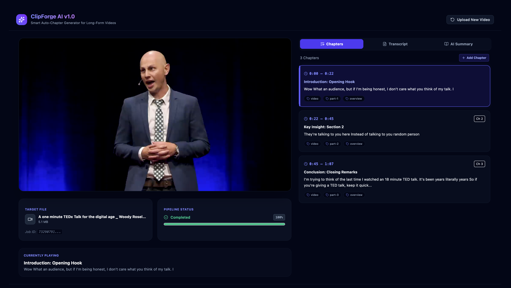

# ClipForge AI

ClipForge is an enterprise grade video processing tool; it transcribes video files and generates structured chapters using local speech to text models and Gemini or Groq APIs.

## Interface Screenshots

Here is the visual walkthrough of the application interface.

### 1. Video Upload Interface

The upload screen allows dragging and dropping video files or browsing them manually; it supports mp4 and mov formats up to 200MB.


### 2. Video Chapters Panel

The chapters panel lists the generated chapters with timestamps; users can add new chapters; edit chapter title; start time; end time; summary; and tags; or delete chapters.



### 3. Interactive Transcript Panel

The transcript panel displays timestamped segments; clicking a segment seeks the video to that moment; users can edit the transcript inline; and export to SRT; VTT; YouTube Chapters; or XML.


### 4. AI Summary Panel

The summary panel presents a narrative summary; interactive Q&A accordion cards; and a keyword cloud to filter chapters by topic.


## Project Architecture

The application is structured as a fullstack application with a Python backend and a React frontend.

* **Backend**: FastAPI web server; processes videos asynchronously; extracts audio using FFmpeg; transcribes speech using Whisper; and aggregates sections using LLMs.
* **Frontend**: React application built with Vite; styles are managed with Tailwind CSS; icons are powered by Lucide React.

## Project Structure

```
clipforge/
* backend/
  * app/
    * services/
      * audio.py (Audio extraction service using FFmpeg)
      * llm.py (Gemini and Groq API connector)
      * transcriber.py (Whisper transcription model loader)
    * config.py (App configuration and settings)
    * main.py (FastAPI entrypoint and routing)
    * schemas.py (Pydantic schemas)
* frontend/
  * src/
    * App.jsx (Main interface components)
    * main.jsx (Vite entrypoint)
  * package.json (Vite dependencies)
```

## Getting Started

Follow these steps to run the application locally.

### Prerequisites

Ensure you have Python and NodeJs installed on your system; FFmpeg must also be accessible in your path.

### Backend Setup

1. Navigate to the backend directory:
   ```bash
   cd backend
   ```
2. Activate virtual environment:
   ```bash
   source venv/bin/activate
   ```
3. Install dependencies:
   Install the required libraries listed inside the backend requirements file using the standard pip package manager.
4. Start FastAPI server:
   ```bash
   uvicorn app.main:app
   ```

### Frontend Setup

1. Navigate to the frontend directory:
   ```bash
   cd frontend
   ```
2. Install dependencies:
   ```bash
   npm install
   ```
3. Start Vite development server:
   ```bash
   npm run dev
   ```
